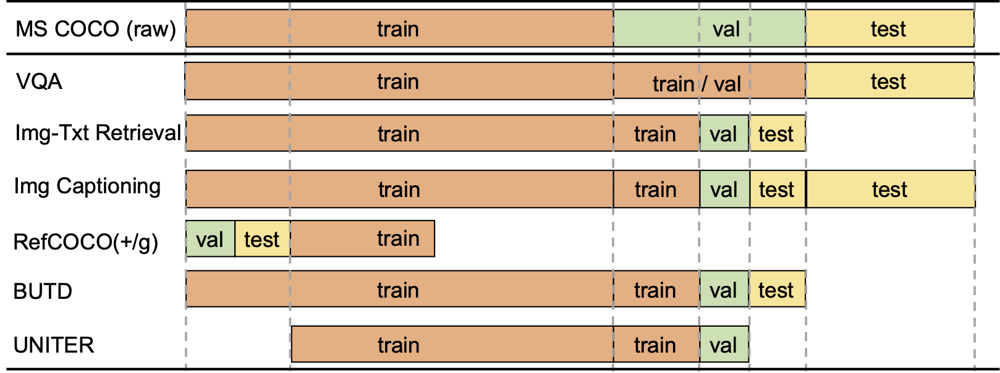
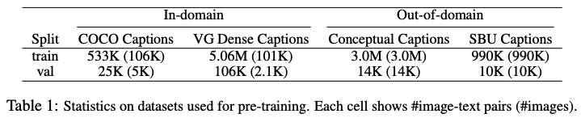

# Pretrain-VL-Data
Prepare the pre-trained V+L Data, which includes COCO, Visual Genome, Conceptual Captions, and SBU Captions.

# Note
As specified in the appendix [UNITER](https://arxiv.org/pdf/1909.11740.pdf), our full pre-trained dataset is composed of four existing V+L datasets: COCO, Visual Genome, Conceptual Captions, and SBU Captions.
The dataset collection is not simply combining them, as we need to make sure none of the downstream evaluation images are seen during pre-training.
Among them, COCO is the most tricky one to clean, as several downstream tasks are built based on it.
The following figure lists the splits from VQA, Image-Text Retrieval, COCO Captioning, RefCOCO/RefCOCO+/RefCOCOg, and the bottom-up top-down (BUTD) detection, all from COCO images.

As observed, the validation and test splits of different tasks are scattered across the raw COCO splits.
Therefore, we exclude all those evaluation images that appeared in the downstream tasks.
In addition, we also exclude all co-occurring Flickr30K images via URL matching, making sure the zero-shot image-text retrieval evaluation on Flickr is fair.
The remaining images become the COCO subset within our full dataset, as shown in the bottom row of this figure.
We apply the same rules to Visual Genome, Conceptual Captions, and SBU Captions.

<p align="center">
  
</p>

By running this code, we should get in-domain and out-of-domain data like the follows:
<p align="center">
  
</p>

# Prepare Data
Download [COCO](http://cocodataset.org/#download), [VG](https://visualgenome.org/api/v0/api_home.html), [Refer](https://github.com/lichengunc/refer), [Flickr30K](http://bryanplummer.com/Flickr30kEntities/), [Karpathy's splits](https://github.com/peteanderson80/bottom-up-attention/tree/master/data/genome/coco_splits), and organize the data as the follows:

```
$DATA_PATH
├── coco
│   ├── annotations
│   └── karpathy_splits
├── flickr30k
│   └── flickr30k_entities
├── refer
│   ├── refclef
│   ├── refcoco
│   ├── refcoco+
│   └── refcocog
└── vg
    ├── image_data.json
    └── region_descriptions.json
```

# Run scripts
Run the following scripts:
```bash
# rule out RefCOCO's val+test and Flickr30K images.
python tools/get_excluded_iids.py

# collect coco's captions
python tools/collect_coco_captions.py

# collect VG's captions
python tools/collect_vg_captions.py

# collect sbucaptions (TODO)
python tools/collect_sbucaptions.py
```
